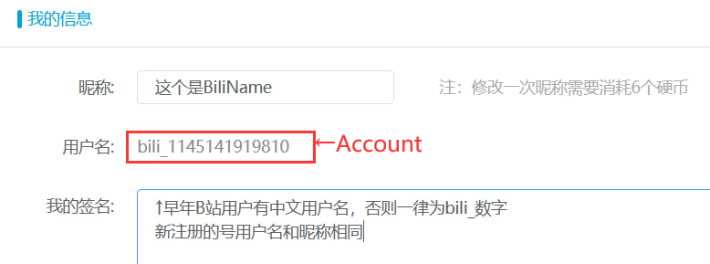

# 登录配置指引

## 登录模式配置

**注意**：请检查代码版本是否高于`V2.8.20230525`，更新后启动一次`main_new.py`，才能在`config.ini`中找到以下的配置项。

目前可选的登录模式有：
- 切换记录 | switch （模拟器自动从登录记录中选择对应账户登录）
- 自动填充 | autofill （模拟器自动填充账号密码登录）
- 手动登录 | manual （脚本弹窗暂停，等待用户登录并确认）

其中切换记录功能带有失败自动回退功能，可选择在切号失败时：
- 自动填充 | autofill
- 手动登录 | manual
- 跳过账号 | skip

目前由于B站风控原因，使用账号密码登录大概率遇到验证码，推荐使用**切换记录**模式登录。

方便起见，可以在一个模拟器上提前登录所有账户并下好数据（你一定不想好几个模拟器一起下载几个GB的数据对吧），然后使用多开管理器复制该模拟器，登录记录也会被一并复制。

登录记录的到期时间为30天左右，期间只要有成功的登录，到期时间会自动刷新。理论上如果你每天都跑脚本是不需要重新输入账号密码的，以防万一我们可以设置失败自动回退。

如果你有稳定的打码渠道可以使用**切换记录+自动填充**模式：
```ini
[pcrfarm_setting]
...
account_login_mode = switch
account_login_switch_fallback = auto
```

如果你不想配置打码，则可使用**切换记录+手动登录**模式：
```ini
[pcrfarm_setting]
...
account_login_mode = switch
account_login_switch_fallback = manual
```

没有打码+无人值守时可以选择**切换记录+跳过账号**模式。

## 登录需要的账户信息及对应关系

目前一个用户(`user`)由三个要素组成，以`json`格式存储在`users`文件夹下：
```json
{
    "account": "可以是B站用户名/邮箱/手机号",
    "password": "zhe_shi_mi_ma",
    "biliname": "bili_1145141919810"
}
```

这三者分别对应游戏登录框的：

 
 

也可登录B站网页版，"个人中心"->"修改资料"可见：

 

**注意**：若手动修改`users`文件夹内的配置，请务必保证**文件名称**和`account`项相同，否则使用脚本内置编辑器编辑用户时，会找不到对应用户！`Batch`，`Group`，`Schedule`也可能无法找到用户！
